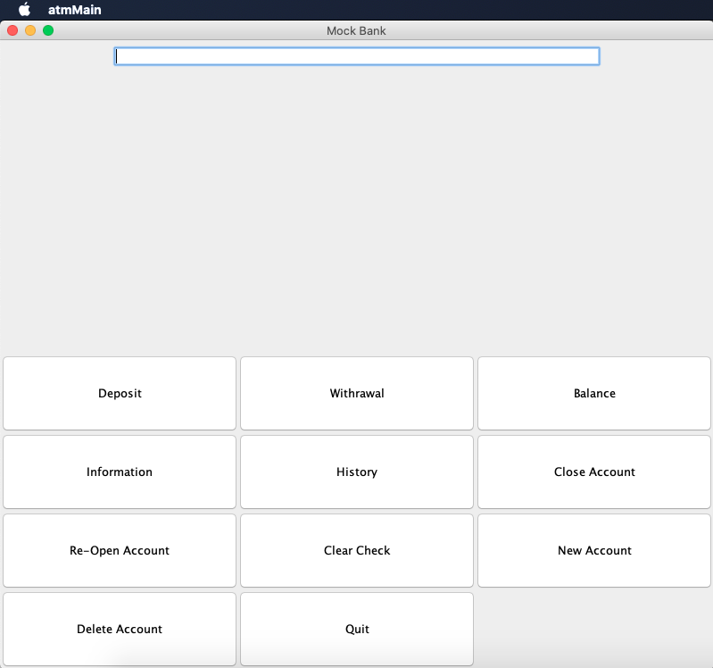
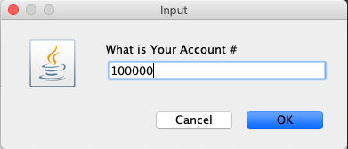
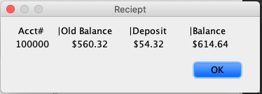
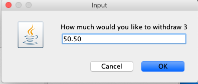
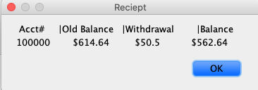

# BankAccount-Gui

<h1 align="center">
   
 Bank Account Gui
   
</h1>

<h4 align="center">A simple application that implements Java swing to impliment the functions of a bank tellers machine     
  
    
  
  
'
 

  

Key Features
 

* The application inital start up reads from a text file labled "Initial_Data.txt
   
    This file contains information about the account holder.
       
        * first and last name
           
        * 9 digit SSN
           
        * 6 digit account number
           
        * current balance
           
        * account type
           
        * date opened/last accessed

      
    * Depending on the function selected the program request different parameters from the User:
       
      * Deposit(D)- deposits a balance within the account [requires account number, balance to be deposited]
         
      * Withdrawal(W) withdrawals a specified balance from an account, if the balance is below $2,500 a $1.50 is charged         
        [requires account number, balance to be Withdraw]
           
      * Balance(B) - displays the current balance within the specified account [requires account number]
         
      * Account_Info(I)displays all the accounts and information pertaining to a specified social[requres a valid ssn]
         
      * Trans_History(H)- displays all the account information and transaction history pertaining to a specified social[requires a vald ssn]
         
      * Close_Account(S)- closes a specified account, transactions cannot be performed[requires account number]
         
      * Re_openAccount(R)- opens an account that has been closed, transactions can be perfomed again[requires account number]
         
      * Clear_Check(C)- Deposits a check given the parameters charged a $2.50 if check bounces because of date experation  checks if the check is being deposited too early or late (6months)[account being deposited to, check date, check amount]
        
      * New Account(N) - creates a new account given an account number that isnt in the system/social/account type
        
      * Delete Account(D) - deletes an account if the account is in the system has a balance of 0 and is closed
        
      * Quit(Q)- closes the application and prints a document with all the accounts/ standing balance and transactions performed
   

  

How to use
 

* Open program using command line for best results*
   
* Main Java file found in directory path Bank/src/atmMain.java
   
* javac atmMain.java->java atmMain
   
* a pop up window opens up displaying the options ( on the gui only deposit and withdrawal work atm more to come)
   

    
   
 
 <h2> Project Details </h2>
 Below is a demonstration of the project:

  
  
  
 

    

      

      

