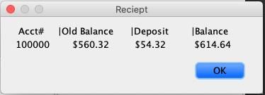

<!-- PROJECT LOGO -->
<br />
<p align="center">
  

  <h3 align="center">Bank Account Gui</h3>

  <p align="center">
    A simple application that implements Java swing to implement the functions of a bank tellers machine!
    <br />
    <a href="https://github.com/Echochris234/BankAccount-Gui"><strong>Explore the docs »</strong></a>
    <br />
    <br />
    <a href="https://github.com/Echochris234/BankAccount-Gui">View Demo</a>
    ·
    <a href="https://github.com/Echochris234/BankAccount-Gui/issues">Report Bug</a>
    ·
    <a href="https://github.com/Echochris234/BankAccount-Gui/issues">Request Feature</a>
  </p>
</p>


<!-- TABLE OF CONTENTS -->
<details open="open">
  <summary>Table of Contents</summary>
  <ol>
    <li>
      <a href="#about-the-project">About The Project</a>
      <ul>
        <li><a href="#built-with">Built With</a></li>
      </ul>
    </li>
    <li>
      <a href="#getting-started">Getting Started</a>
    </li>
    <li><a href="#usage">Usage</a></li>
    <li><a href="#license">License</a></li>
    <li><a href="#contact">Contact</a></li>

  </ol>
</details>


<!-- ABOUT THE PROJECT -->
## About The Project

[![Product Name Screen Shot][product-screenshot]](https://example.com)

The application initially was a Command line program where functions where called based on the user input. The upgraded edition of the project has added a GUI using Java Swing framework. The simple application uses Java swing to implement the functions of a bank tellers machine using complex arithmatics while adhering to object oriented design in a simple and clean UI.  

Motication:
* To practice using various object oriented concepts including: encapsulation,abstraction,inheritance, and polymorphism.
* To learn use different Java frameworks on a real world application
.

### Built With

This section should list any major frameworks that you built your project using. Leave any add-ons/plugins for the acknowledgements section. Here are a few examples.
* [Ecliplse](https://www.eclipse.org)
* [Java](https://docs.oracle.com/javase/7/docs/api/)
* [JavaSwing](https://docs.oracle.com/javase/tutorial/uiswing/index.html)
* [Laravel](https://laravel.com)


<!-- GETTING STARTED -->
## Getting Started

1. Clone the repo
   ```sh
    git clone https://github.com/Echochris234/BankAccount-Gui.git
   ```
2. Install Eclipse 
   ```sh
    [Ecliplse](https://www.eclipse.org)
   ```
3. Open Project in Eclipse:
 
4. Run Program[GUI pop-up should appear]


<!-- USAGE EXAMPLES -->
## Usage

* The application inital start up reads from a text file labled "Initial_Data.txt
 <br><br>
    This file contains information about the account holder.
     <br><br>
        * first and last name
         <br><br>
        * 9 digit SSN
         <br><br>
        * 6 digit account number
         <br><br>
        * current balance
         <br><br>
        * account type
         <br><br>
        * date opened/last accessed

  <br> <br><br>
    * Depending on the function selected the program request different parameters from the User:
     <br><br>
      * Deposit(D)- deposits a balance within the account [requires account number, balance to be deposited]
       <br><br>
      * Withdrawal(W) withdrawals a specified balance from an account, if the balance is below $2,500 a $1.50 is charged         
        [requires account number, balance to be Withdraw]
         <br><br>
      * Balance(B) - displays the current balance within the specified account [requires account number]
       <br><br>
      * Account_Info(I)displays all the accounts and information pertaining to a specified social[requres a valid ssn]
       <br><br>
      * Trans_History(H)- displays all the account information and transaction history pertaining to a specified social[requires a vald ssn]
       <br><br>
      * Close_Account(S)- closes a specified account, transactions cannot be performed[requires account number]
       <br><br>
      * Re_openAccount(R)- opens an account that has been closed, transactions can be perfomed again[requires account number]
       <br><br>
      * Clear_Check(C)- Deposits a check given the parameters charged a $2.50 if check bounces because of date experation  checks if the check is being deposited too early or late (6months)[account being deposited to, check date, check amount]
      <br><br>
      * New Account(N) - creates a new account given an account number that isnt in the system/social/account type
      <br><br>
      * Delete Account(D) - deletes an account if the account is in the system has a balance of 0 and is closed
      <br><br>
      * Quit(Q)- closes the application and prints a document with all the accounts/ standing balance and transactions performed
  <br>


<br><br>
  <p align= "center">
    

      

      

</p>


<!-- LICENSE -->
## License

Distributed under the MIT License. See `LICENSE` for more information.


<!-- CONTACT -->
## Contact

Christian Vargas - ChristianVargas1595@gmail.com

Project Link: [https://github.com/Echochris234/BankAccount-Gui](https://github.com/Echochris234/BankAccount-Gui)

